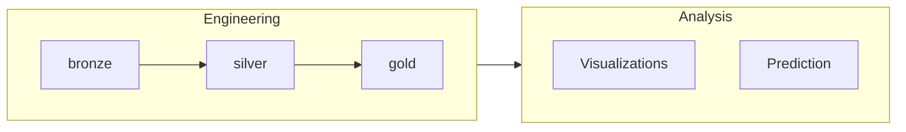
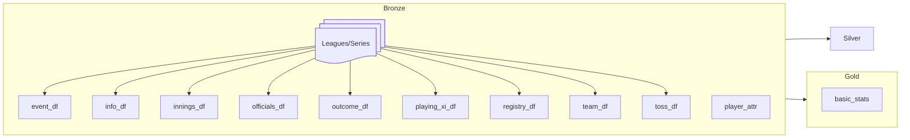
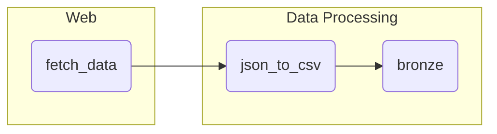

# Cricketing Data

## High Level Process

```mermaid
graph LR
    subgraph Engineering
        direction LR
        bronze --> silver
        silver --> gold
    end
    subgraph Analysis
        dash[Visualizations]
        C[Prediction]
    end
    Engineering --> Analysis
    
```

## Data Flow Process

```mermaid
graph LR
    subgraph Bronze
        direction TB
        A@{ shape: docs, label: "Leagues/Series" } --> event_df
        A --> info_df
        A --> innings_df
        A --> officials_df
        A --> outcome_df
        A --> playing_xi_df
        A --> registry_df
        A --> team_df
        A --> toss_df
        player_attr
    end
    Bronze --> Silver
    Bronze --> Gold
    subgraph Gold
        basic_stats
    end
```

## Pipeline

```mermaid
graph LR
subgraph Web
    id1
end
id1(fetch_data) --> id2(json_to_csv)
subgraph Data Processing
    id2 --> id3(bronze)
end
```